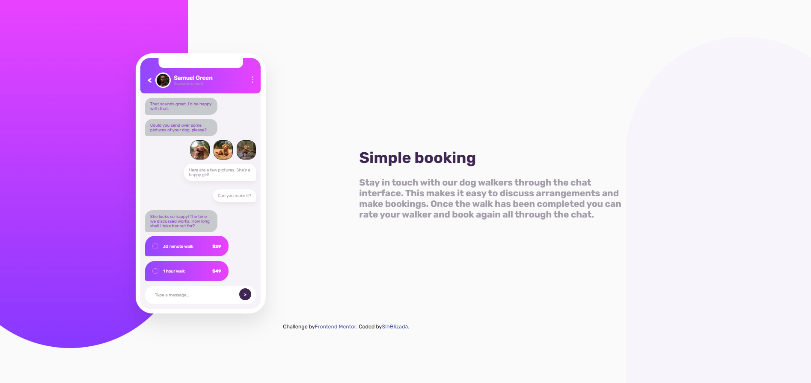

# Frontend Mentor - Chat App Css Illustration

## Welcome! 👋

# Frontend Mentor - Chat App Css Illustration Solution

This is my solution to the [Frontend Mentor](https://www.frontendmentor.io/) Chat App Css Illustration.

## Table of Contents
- [Overview](#overview)
  - [Screenshot](#screenshot)
  - [Links](#links)
- [Process](#process)
  - [Technologies Used](#technologies-used)
  - [What I Learned](#what-i-learned)
- [Author](#author)

## Overview
In this project, I coded a Intermediate level web page that I took from the Frontendmentor.io website.

### Screenshot

.png)
.png)

### Links
- Solution URL: https://github.com/Salih-Alizade/WebTap-r-qFF
- Live Site URL: [https://github.com/Salih-Alizade/WebTap-r-qFF/settings/pages](https://salih-alizade.github.io/WebTap-r-qFF/)

## Process

    I will fill in process here later.

### Technologies Used
- HTML5
- CSS3
- Flexbox
- CSS Grid
- CSS Media Queries (For responsive design)
- Desktop-first workflow
- Absolute and Relative Positioning

### What I Learned

    I will fill in my learnings here later.

## Author
- Frontend Mentor - [@Salih-Alizade](https://www.frontendmentor.io/profile/Salih-Alizade)
- GitHub - [Salih-Alizade](https://github.com/Salih-Alizade)
